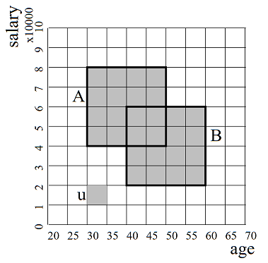

# CLIQUE

[CLIQUE] is a subspace clustering algorithm using a bottom up approach to find all clusters in all subspaces. It starts examining one dimensional subspaces and merges them to compute higher dimensional ones. It uses the downward-closure property to achieve better performance by considering subspaces only if all of its k-1 dimensional projection contains cluster(s).

In the context of the algorithm, clusters are dense regions. It partitions the feature space into xsi equal parts in each dimension, where the intersection of one interval from each dimension is called unit. If a unit contains more than tau parts of all the data points, then it is a dense unit. Clusters are the maximal sets of connected dense units. For example in Figure 1, dense region A and dense region B are connected, therefore A U B is a cluster.



Figure 1: Dense units in feature space

### Strengths
CLIQUE is used not only to detect clusters but to identify subspaces which contain clusters at the same time. It is a fast and uses a relatively simple approach of finding clusters. It was introduced in 1998 motivated by finding an automatic subspace algorithm without requiring the user to guess subspaces which might contain interesting clusters.


### Weaknesses
The quality of the results are highly dependent of the input parameters xsi and tau. As the density threshold is constant over all dimensionality, it would require the data points to have the same density in high and low dimensionality to find interesting clusters in all subspaces with the same tau. The location of the grid lines also make a huge difference to the resulting clusters.

# Pseudocode

```
clique(data, xsi, tau){

    data_size = get_length(data)
    number_of_features = get_width(data)

    # Finding 1 dimensional dense units
    D1 = []
    for feature in get_features(data)
        for unit in feature
            if(get_data_points_in(unit) > (data_size * tau))
                D1.add(unit)
    
    for(k = 2; k <= number_of_features; k++){
        # Candidate generation for k > 1 dimensions
        Ck = self_join(elements=D(k-1), condition=(share (k-2)dimensions))
        
        # Finding k > 1 dimensional dense units
        Dk = Ck[have all (k-1) projection in D(k-1)]
í    }

    # Finding clusters
    for(all feature set f={F1,F2,...,Fk} containing dense units){
        #Build G graph with dense units as nodes, connection between dense units (having a common face) as edges
        G = identity_matrix(n = number_of_dense_units_in(f))
        for(i,j running [0-n])
            if(i=j)
                G[i,j] = 1
            else if(are_connected(get_unit(f,i), get_unit(f,j))
                G[i,j] = 1
            else
        G[i,j] = 0
        clusters = get_connected_components(G)
    }
}
```
# Implementation

### Requirements

The implementation is in Python language, all additional libraries used are listed in requirements.txt. To install them in an environment, use the following command:

pip install -r requirements.txt
3.2 Running the code

#### Windows

Using Windows if the python interpreter is not already in the $PATH environmental variables, then you should run it using the following format (using your python interpreter):

`C:\Python36\python.exe C:\Users\...\Clique.py`

#### Mac, Linux, BSD, Unix

On these platforms python interpreter is typically already added to $PATH, so from the directory of the .py file you can simply use:

`python.exe Clique.py`

#### Parameters

Running the script without parameters runs a default clustering on one of datasets in the folder. To run it with your settings you can use the following parameters:

`python Clique.py mouse.csv [0,1] 2 3 0.3 " " output_clusters.txt`

- mouse.csv             - file name of the csv dataset provided in the same directory
- [0,1]                 - numerical data columns of the dataset
- 2                     - true labels of the clusters
- 3                     - xsi parameter for CLIQUE
- 0.3                   - tau parameter for CLIQUE
- " "                   - separator used in csv
- output_clusters.txt   - [optional] output file name (default = clusters.txt)

# Evaluating results

### Scikit-learn

Running Clique.py automatically evaluates clustering in all subspaces containing clusters using scikit-learn package. In all used evaluation methods higher means better performance. Detailed description of evaluation scores is not in scope of this document, for further information please visit [scikit-learn documentation].

Bounds of each evaluation methods:
- Adjusted Rand index: [-1,1]
- Mutual Information: upper bound of 1
- Homogeneity: [0,1]
- completeness: [0,1]
- V-measure: [0,1]
- Fowlkes-Mallows: [0,1]


The output of the evaluation has the following format:

```
Evaluating clusters in dimension:  [0, 1]
Number of clusters:  3
Adjusted Rand index:  0.5902342864120859
Mutual Information:  0.6631758799103057
Homogeneity, completeness, V-measure:  (0.8747287335267985, 0.6655191190040727, 0.7559156081896049)
Fowlkes-Mallows:  0.7412482467784445
```


[CLIQUE]:https://www.cs.cornell.edu/johannes/papers/1998/sigmod1998-clique.pdf
[scikit-learn documentation]:https://scikit-learn.org/stable/modules/clustering.html#clustering-performance-evaluation
